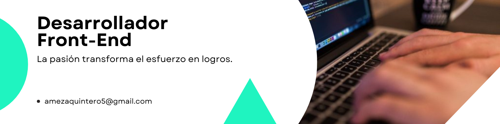

 
    <h1 align="center">👋 Hola, soy Anibal Quintero</h1>

  

  

## 👨🏻‍💻 Acerca de mí

- 🙋‍♂️ Todo sobre mí lo puedes encontrar en mi **[sitio web](https://portfolio-anibal-quintero.vercel.app/)**.

- 👨‍💻 Soy un desarrollador web enfocado en crear soluciones visuales y funcionales.

- 💻 Mi experiencia incluye tecnologías como **Angular**, **React** y **Node.js**, y siempre estoy aprendiendo nuevas herramientas y técnicas.

- 🚀 Me gusta el **desarrollo front-end**, ya que me permite dar vida a ideas y conectar a las personas con la tecnología de manera intuitiva.

- 🎯 Actualmente, busco **oportunidades laborales** para seguir creciendo como desarrollador, con un enfoque particular en el front end

- 💡 Creo en el **aprendizaje continuo** y el **trabajo colaborativo**, y siempre estoy dispuesto a contribuir en proyectos de impacto.

- 🤓 Dato curioso: Cuando no estoy programando, disfruto pasar tiempo con mi familia

 

## 🛠️ Tecnologías y herramientas que uso

  
  
  
  
  
  
  
  
  
  
  
  
  
  
  
  
  
  
  
  
  
  

 

## 🌐 Conéctate conmigo

  
  
  

 
